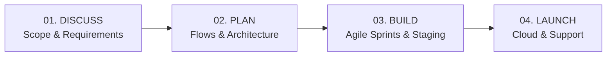

# ✨ NovaCraft Studio — Digital Engineering & Web Development Team

<div align="center">


### **Websites & Custom Software Built Around Your Business.**
*A focused, agile 2–3 person engineering studio creating high-performance business websites, web applications, booking engines, and operations dashboards with transparent, project-based pricing.*

[](https://craftedpage.vercel.app)
[](https://wa.me/918807006909)
[](mailto:aravindvjm2004@gmail.com)

</div>

---

## 🧭 About NovaCraft Studio

We are an independent, developer-led engineering team of **2–3 engineers** focused on building practical, reliable, and high-impact digital systems for growing businesses, startups, and operational teams.

### 🌟 Why Clients Choose Our Team
* **Zero Middlemen / Direct Senior Access**: You communicate directly with the engineers designing and writing the code. No agency account managers, no telephone game.
* **Modern & Clean Engineering**: Lightweight, lightning-fast architecture with zero dependency bloat. We prioritize load speed, clean mobile UX, and SEO.
* **Milestone & Fixed Pricing**: Clear scope, fixed estimates, and transparent deliverable timelines before any code is written.
* **Rapid Turnaround**: Coordinated agile sprints with live staging demo links throughout development.

---

## 🛠️ Core Services & Solutions

| Service | Focus & Deliverables | Tech Highlights |
| :--- | :--- | :--- |
| **🌐 High-Conversion Business Websites** | Professional online presence, branding, SEO structure, mobile optimization, lead capture forms. | HTML5, CSS3, Vanilla JS, Responsive Design |
| **📅 Booking & Rental Management Systems** | Direct reservation calendars, WhatsApp instant booking, automated receipts, vehicle/villa rentals. | Node.js, REST APIs, Webhooks, Instant Notifications |
| **📊 Operations & Admin Dashboards** | Internal business portals, live inventory tracking, employee task delegation, financial charts. | Real-time state management, SVG charts, CSV exports |
| **⚡ Workflow Automation & Integration** | Custom CRM sync, email triggers, payment links, WhatsApp bot alerts, database migration. | Cloud Functions, Third-party APIs, Zapier/Custom |

---

## 🔄 Our 4-Stage Development Process



1. **💬 01. Discuss (Starting Point)**:
   We listen closely to your business operational goals, asking the right technical questions to uncover what your business truly requires.
2. **📋 02. Plan**:
   We map user journeys, select the ideal architecture, and deliver a detailed scope breakdown, timeline, and fixed estimate.
3. **⚙️ 03. Build**:
   We engineer the product in coordinated sprints, sharing regular staging links so you can test features and provide feedback early.
4. **🚀 04. Launch**:
   We handle cloud deployment, domain DNS setup, SSL certificates, performance verification, and provide post-launch walkthrough support.

---

## 🏆 Featured Client Projects

### 1. **StayEase — Hospitality & Villa Booking Platform**
* **Type**: Web Application & Reservation Engine
* **Features**: Live dates availability calendar, custom price calculation, instant WhatsApp owner alerts, mobile-first booking interface.
* **Impact**: 45% increase in direct commission-free reservations.

### 2. **TrackFlow — Operations & Fleet Dispatch Portal**
* **Type**: Internal Operations Admin Dashboard
* **Features**: Live fleet status table, real-time KPI metrics, dispatch status toggling, CSV/PDF report exporter.
* **Impact**: Saved 12+ administrative hours weekly for dispatch managers.

### 3. **SwiftMedia — High-Performance Media Utility**
* **Type**: SaaS Tool
* **Features**: Client-side video trimming, format transcoding, instant preview, zero server lag.
* **Impact**: 20k+ monthly active operations handled smoothly.

---

## ⚡ Technical Stack & Architecture

- **Frontend**: Semantic HTML5, CSS Variables, Fluid Typography, Modern CSS Grid & Flexbox, Canvas 2D Particle Engine.
- **Client-Side Engine**: Vanilla ES6+ JavaScript, IntersectionObserver API, requestAnimationFrame physics loops, reduced-motion accessibility overrides.
- **Form Delivery Engine**: FormSubmit AJAX API with automated email dispatch, live beacon badges, and fail-safe WhatsApp/Mailto direct links.
- **Performance**: 100/100 Lighthouse performance potential, zero framework overhead, hardware-accelerated animations.

---

## 📁 Repository Structure

```text
craftedpage/
├── assets/
│   ├── favicon.svg          # High-DPI geometric favicon
│   └── logo.svg             # Brand vector emblem (Nexus N)
├── index.html               # Main semantic HTML5 markup
├── style.css                # Master stylesheet (dark theme & micro-animations)
├── script.js                # Interactive logic & form handling
├── .gitignore               # Ignored development files
└── README.md                # Studio overview & documentation
```

---

## 🚀 Running Locally

```bash
# Clone the repository
git clone https://github.com/Aravind0511/craftedpage.git
cd craftedpage

# Run with Python
python -m http.server 3000

# Or run with Node.js
npx http-server . -p 3000
```

Open **`http://localhost:3000`** in your browser.

---

## 🤝 Let's Discuss Your Project

Ready to build your website, application, or business automation? Reach out directly to our engineering team:

- **💬 WhatsApp**: [**+91 88070 06909**](https://wa.me/918807006909)
- **📧 Email**: [**aravindvjm2004@gmail.com**](mailto:aravindvjm2004@gmail.com)
- **🌐 Live Production**: [**https://craftedpage.vercel.app**](https://craftedpage.vercel.app)

*© 2026 NovaCraft Studio. Built for business growth.*
