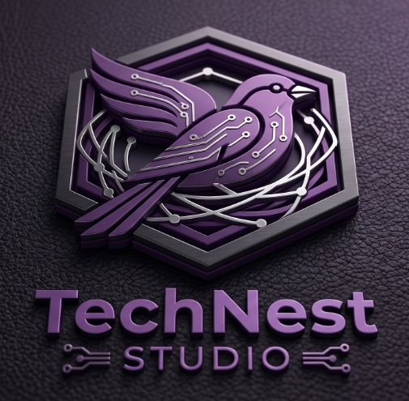
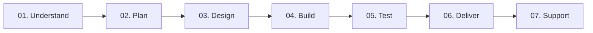

# ✨ TechNest Studio — Digital Engineering & Web Development Team

<div align="center">



### **✨ Imagine • Build • Transform**
#### *TechNest Studio — Turning ideas into digital experiences.*

*A focused, agile engineering studio creating high-performance business websites, web applications, booking engines, and operations dashboards with transparent, project-based pricing.*

[](https://techneststudio.in)
[](https://wa.me/918807006909)
[](mailto:studiotechnest@gmail.com)

</div>

---

## 🧭 About TechNest Studio

TechNest Studio is an independent, developer-led digital engineering team of **2–3 core developers** building practical software, websites, applications, and creative digital experiences for businesses, startups, and operational teams.

### 🌟 Why Clients Work Directly With Our Team
* **Zero Middlemen / Direct Senior Access**: You communicate directly with the developers writing your code. No bureaucracy, account managers, or junior handoffs.
* **Modern & Clean Engineering**: High-performance, lightweight architecture with zero dependency bloat. We prioritize load speed, clean mobile UX, and SEO.
* **Milestone & Fixed Pricing**: Clear scope, fixed estimates, and transparent deliverable timelines before any code is written.
* **Direct Dev-to-Client Communication**: Rapid feedback loops via WhatsApp and video calls throughout development.

---

## 🛠️ Core Services & Deliverables

| Service | Focus & Scope | Deliverables & Highlights | Route |
| :--- | :--- | :--- | :--- |
| **🌐 Web Development** | Modern, responsive, SEO-friendly websites. | Business websites, landing pages, responsive web design, technical SEO. | [`/services/web-development`](https://techneststudio.in/services/web-development) |
| **📱 Application Development** | Reliable, intuitive, user-focused digital experiences. | Android applications, mobile solutions, interactive applications. | [`/services/application-development`](https://techneststudio.in/services/application-development) |
| **⚙️ Custom Software** | Scalable business software & workflow tools. | Internal portals, workflow tools, operational dashboards, custom solutions. | [`/services/custom-software`](https://techneststudio.in/services/custom-software) |
| **🎨 UI/UX Design** | Clean, user-centered digital interfaces. | Wireframing, interactive prototyping, design systems, responsive interfaces. | [`/services/ui-ux-design`](https://techneststudio.in/services/ui-ux-design) |
| **🎬 Video Editing** | Engaging, polished video content for brands. | Reels & shorts, promotional videos, corporate videos, cinematic editing. | [`/video-editing`](https://techneststudio.in/video-editing) |
| **🛠️ Maintenance & Support** | Continuous product reliability & upkeep. | Website updates, bug fixes, technical support, ongoing performance tuning. | [`/services/maintenance-support`](https://techneststudio.in/services/maintenance-support) |

---

## 🔄 How We Work (7-Step Process)


```mermaid
flowchart LR
    A["01. Understand"] --> B["02. Plan"]
    B --> C["03. Design"]
    C --> D["04. Build"]
    D --> E["05. Test"]
    E --> F["06. Deliver"]
    F --> G["07. Support"]
```

1. **01 — Understand**: Understand your goals, requirements, and ideas.
2. **02 — Plan**: Define the right technology, structure, and experience.
3. **03 — Design**: Create an intuitive interface and experience.
4. **04 — Build**: Develop the solution with attention to quality and performance.
5. **05 — Test**: Validate functionality, responsiveness, and reliability.
6. **06 — Deliver**: Deploy the finished digital product.
7. **07 — Support**: Provide ongoing improvements and technical support.

---

## 🏆 Featured Client Projects

### 1. **StayEase — Hospitality & Villa Booking Platform**
* **Type**: Web Application & Reservation Engine
* **Features**: Live dates availability calendar, custom price calculation, instant WhatsApp owner alerts, mobile-first booking interface.
* **Impact**: 45% increase in direct commission-free reservations.

### 2. **TrackFlow — Operations & Fleet Dispatch Portal**
* **Type**: Internal Operations Admin Dashboard
* **Features**: Live fleet status table, real-time KPI metrics, dispatch status toggling, CSV/PDF report exporter.
* **Impact**: Saved 12+ administrative hours weekly for dispatch managers.

### 3. **SwiftMedia — High-Performance Media Utility**
* **Type**: SaaS Tool
* **Features**: Client-side video trimming, format transcoding, instant preview, zero server lag.
* **Impact**: 20k+ monthly active operations handled smoothly.

---

## ⚡ Technical Stack & Architecture

- **Frontend**: Semantic HTML5, CSS Variables, Fluid Typography, Modern CSS Grid & Flexbox, Canvas 2D Particle Engine.
- **Client-Side Engine**: Vanilla ES6+ JavaScript, IntersectionObserver API, requestAnimationFrame physics loops, reduced-motion accessibility overrides.
- **Form Delivery Engine**: FormSubmit AJAX API with automated email dispatch, live beacon badges, and fail-safe WhatsApp/Mailto direct links.
- **Performance**: 100/100 Lighthouse performance potential, zero framework overhead, hardware-accelerated animations.

---

## 📁 Repository Structure

```text
techneststudio/
├── assets/                  # Brand logos, icons, badges
├── index.html               # Homepage (Overview, Services preview, Process, Video preview)
├── services.html            # Core Services Hub (/services)
├── video-editing.html       # Dedicated Video Editing (/video-editing)
├── what-we-build.html       # Deliverables Catalog (/what-we-build)
├── process.html             # 7-Step Engineering Timeline (/process)
├── about.html               # About Studio & Developer Core (/about)
├── contact.html             # Consultation & Inquiry Form (/contact)
├── web-development.html     # Deep dive: Web Development
├── app-development.html     # Deep dive: Application Development
├── custom-software-development.html # Deep dive: Custom Software
├── ui-ux-design.html        # Deep dive: UI/UX Design
├── maintenance-support.html # Deep dive: Maintenance & Support
├── case-studies.html        # Real-World Projects Hub
├── style.css                # Master dark theme & micro-animations
├── script.js                # Interactive logic, 3D tilt, drawers, & forms
├── sitemap.xml              # Search engine index map
├── robots.txt               # Crawler directives
├── llms.txt                 # LLM context & architecture index
└── README.md                # Studio overview & documentation
```

---

## 🚀 Running Locally

```bash
# Clone the repository
git clone https://github.com/Aravind0511/portfolio.git
cd portfolio

# Run with Python
python -m http.server 3000

# Or run with Node.js
npx http-server . -p 3000
```

Open **`http://localhost:3000`** in your browser.

---

## 🤝 Let's Discuss Your Project

Ready to build your website, application, or business automation? Reach out directly to our engineering team:

- **💬 WhatsApp**: [**+91 88070 06909**](https://wa.me/918807006909)
- **📧 Email**: [**studiotechnest@gmail.com**](mailto:studiotechnest@gmail.com)
- **🌐 Official Website**: [**https://techneststudio.in**](https://techneststudio.in)

*✨ Imagine • Build • Transform*  
*© 2026 TechNest Studio. Turning ideas into digital experiences.*
